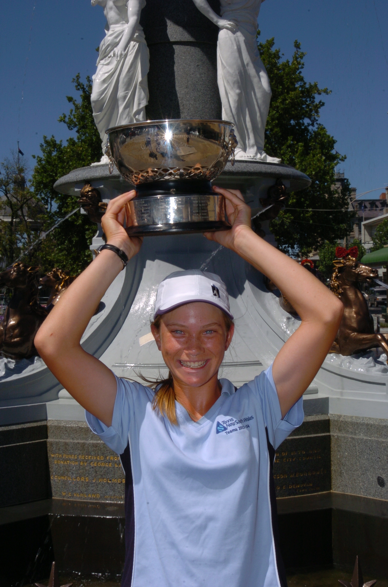

# About Jenny

As a junior tennis player, Jenny was among the best girls in Australia in her age group. At 12 years old she became a NSW state champion and was undefeated at singles throughout the NSW Interdistrict season as the number 1 player in her team, while playing in the top division of the 14/U age group. She also became an Australian national champion at the age of 12 and played for Australia. At 14 she won her second Australian national singles title followed by her third at 15, in the 16/U age group. At an international level, she won 2 18/U singles titles (ITF grades 4 and 5) at the age of 15. She won countless other titles as a junior. As for doubles, her highlights were winning 5 Australian national doubles titles and 2 grade 4 ITF junior doubles titles. 

Jenny had the experience of working with many coaches and was exposed to a wide range of coaching strategies. She was in Tennis Australia’s Targeted Athlete Program, the NSW Institute of Sport, state squads, training camps and teams events with court-side coaching. Jenny had various private coaches, including a tennis footwork specialist and her dad, with whom she spent a lot of time working on her game off-court - using video analysis, comparing her game to the pros, practicing her strokes, experimenting with different ideas or watching instructional videos. 

Jenny loved the game but her tennis playing career came to an abrupt end due to chronic illness. Many years later, she started playing again, this time not with the hope of playing professionally but because she experienced a dramatic improvement in her health when she played. She was amazed at the difference playing tennis made to her quality of life and therefore started to see tennis in a new light - that if she were to try and help people become better tennis players and to enjoy the game more, she may be helping them to have a better life. 

